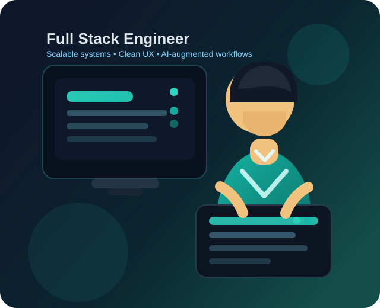

  

  

  
  
  
  

  <i>Engineer first. Product-minded. Focused on scalable systems, clean UX, and fast execution.</i>

## About Me

<table>
  <tr>
    <td width="63%" valign="top">
      

        I am <strong>Abdullah Ali</strong>, a <strong>Full Stack Software Engineer</strong> and
        <strong>AI-augmented developer</strong> based in <strong>Lahore, Pakistan</strong>.
        I build production-ready web applications, scalable backend systems, and workflow
        automations that help teams move faster without compromising quality.
      

      <ul>
        <li>Building frontend experiences with <strong>React.js</strong>, <strong>Next.js</strong>, <strong>TypeScript</strong>, and <strong>Tailwind CSS</strong></li>
        <li>Designing backend systems with <strong>Node.js</strong>, <strong>Express.js</strong>, <strong>NestJS</strong>, <strong>Redis</strong>, <strong>BullMQ</strong>, and <strong>Socket.IO</strong></li>
        <li>Improving delivery with <strong>AI-assisted workflows</strong>, <strong>n8n automations</strong>, <strong>MCP servers</strong>, and structured prompt engineering</li>
        <li>Strong focus on <strong>performance optimization</strong>, <strong>clean architecture</strong>, <strong>developer productivity</strong>, and <strong>user-centered product delivery</strong></li>
      </ul>
    </td>
    <td width="37%" align="center">
      
    </td>
  </tr>
</table>

## Career Snapshot

| Area | Highlights |
| --- | --- |
| Experience | 3+ years across software engineering, full-stack delivery, and backend architecture |
| Core Strengths | Scalable APIs, modern frontend systems, workflow automation, and AI-augmented engineering |
| Collaboration | Built products with product and design teams and contributed to remote-facing work across Europe and the US |
| Education | **BSCS**, COMSATS University, Lahore (**2018 - 2023**) |

## Impact

- Improved backend performance by **30%** through scalable Node.js and NestJS architecture decisions
- Reduced API response times by **25%** using **Redis** caching and **BullMQ**-powered background processing
- Cut manual effort by **40%** by automating pricing workflows and data pipelines
- Shipped products across **LMS**, **pricing automation**, **real-time systems**, **mobile apps**, and **AI workflow tooling**

## Tech Stack

### Frontend

  
  
  
  
  
  
  
  
  
  

### Backend, Data & Infrastructure

  
  
  
  
  
  
  
  
  
  
  
  
  
  

### AI, Automation & Productivity

  
  
  
  
  
  
  

## Selected Projects

| Project | What I Built | Tech | Outcome |
| --- | --- | --- | --- |
| **DeepSwan (LMS)** | Full-stack learning platform with a custom BlockNote editor, lesson delivery flows, and automation-friendly architecture | React, Express, Tailwind CSS, BlockNote | Improved editor flexibility and streamlined content workflows |
| **CPE (Custom Pricing Engine)** | Pricing automation pipeline with CSV/XLSX ingestion and scalable background processing | Node.js, Redis, BullMQ | Reduced manual effort by **40%** |
| **AI Automation Workflows** | n8n-based automations for APIs, notifications, data sync, and AI-driven workflow orchestration | n8n, MCP Servers, Prompt Engineering | Improved delivery speed and repeatability |
| **Trader Legend** | Real-time trading simulation with live updates and multiplayer synchronization | React, Node.js, Socket.IO | Enabled low-latency real-time interactions |
| **Reserve-it (FYP)** | Mobile booking application with maps, media handling, and backend-connected user flows | React Native, Firebase, Google Maps, Cloudinary | Delivered a complete end-to-end final year product |

## What I Bring

- A strong blend of **frontend delivery** and **backend engineering**
- Practical use of **AI tools and automation** to improve execution speed without lowering quality
- A performance-first mindset for **APIs**, **queues**, **data flows**, and **user experience**
- The ability to move from idea to shipped product with clean communication and strong ownership

## Let's Connect

  
  
  

  Open to impactful full-stack work, scalable backend projects, and AI-assisted product engineering opportunities.

